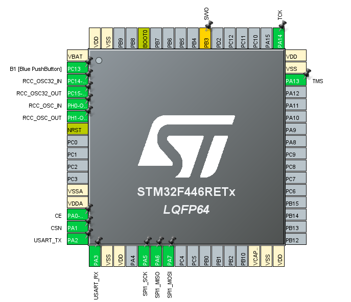
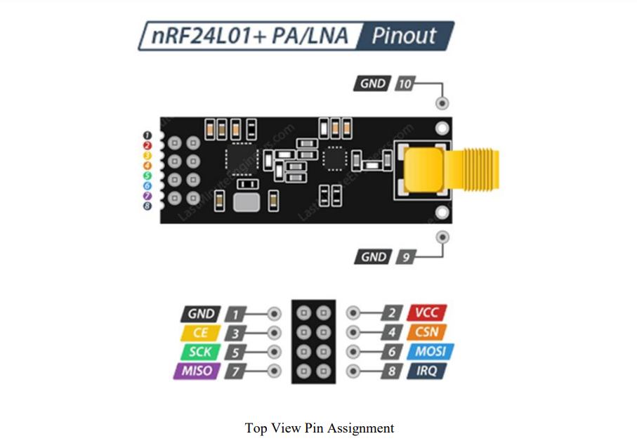

# nRF24L01+ Communication with STM32 Nucleo F446RE

This project demonstrates how to set up and use the nRF24L01+ transceiver with the STM32 Nucleo F446RE development board. It includes steps for initializing the device, transmitting, and receiving data using the SPI interface.

## Pin Layouts

### STM32 Nucleo F446RE Pin Configuration

| Pin | Function             | Description                                      |
|-----|----------------------|--------------------------------------------------|
| PA0 | CE (Chip Enable)     | Controls transmission and reception.             |
| PA1 | CSN (Chip Select Not)| Selects the SPI slave (nRF24L01+).               |
| PA5 | SPI1_SCK             | Serial Clock for SPI communication.              |
| PA6 | SPI1_MISO            | Master In Slave Out for SPI communication.       |
| PA7 | SPI1_MOSI            | Master Out Slave In for SPI communication.       |

### nRF24L01+ Pin Layout

| Pin | Function         | Description                                           |
|-----|------------------|-------------------------------------------------------|
| 1   | GND              | Ground                                                |
| 2   | VCC              | 3.3V Power Supply                                     |
| 3   | CE               | Chip Enable - Controls TX/RX modes                    |
| 4   | CSN              | Chip Select Not - Active low to enable SPI            |
| 5   | SCK              | SPI Clock - Connected to SPI1_SCK (PA5)               |
| 6   | MOSI             | Master Out Slave In - Connected to SPI1_MOSI (PA7)    |
| 7   | MISO             | Master In Slave Out - Connected to SPI1_MISO (PA6)    |
| 8   | IRQ              | Interrupt Request (optional)                          |

## Register Configuration for Initialization

To initialize the nRF24L01+ for basic transmission, the following registers need to be configured:

| Step | Register Name | Address | Value | Description |
|------|---------------|---------|-------|-------------|
| 1    | CONFIG        | `0x00`  | `0x0A`| Power up the device and set to TX mode. |
| 2    | EN_AA         | `0x01`  | `0x3F`| Enable Auto Acknowledge on all data pipes. |
| 3    | EN_RXADDR     | `0x02`  | `0x01`| Enable data pipe 0 for receiving data. |
| 4    | SETUP_AW      | `0x03`  | `0x03`| Set address width to 5 bytes. |
| 5    | SETUP_RETR    | `0x04`  | `0x03`| Set automatic retransmission delay (500 µs) and count (3). |
| 6    | RF_CH         | `0x05`  | `0x02`| Set RF channel to 2402 MHz (Channel 2). |
| 7    | RF_SETUP      | `0x06`  | `0x0E`| Set data rate to 2 Mbps and output power to 0 dBm. |
| 8    | RX_ADDR_P0    | `0x0A`  | `0xE7E7E7E7E7`| Set receive address for pipe 0 (5-byte address). |
| 9    | TX_ADDR       | `0x10`  | `0xE7E7E7E7E7`| Set transmit address (5-byte address). |
| 10   | RX_PW_P0      | `0x11`  | `0x20`| Set payload width to 32 bytes for data pipe 0. |
| 11   | STATUS        | `0x07`  | `0x70`| Clear any pending interrupt flags. |

## Steps for Initialization

1. **Power Up and Set TX Mode**:
   - Write `0x0A` to **CONFIG (0x00)**.
2. **Enable Auto Acknowledge**:
   - Write `0x3F` to **EN_AA (0x01)**.
3. **Enable Data Pipe 0**:
   - Write `0x01` to **EN_RXADDR (0x02)**.
4. **Set Address Width**:
   - Write `0x03` to **SETUP_AW (0x03)**.
5. **Set Retransmission Parameters**:
   - Write `0x03` to **SETUP_RETR (0x04)**.
6. **Set RF Channel**:
   - Write `0x02` to **RF_CH (0x05)**.
7. **Set Data Rate and Power**:
   - Write `0x0E` to **RF_SETUP (0x06)**.
8. **Set RX and TX Addresses**:
   - Write `0xE7E7E7E7E7` to **RX_ADDR_P0 (0x0A)**.
   - Write `0xE7E7E7E7E7` to **TX_ADDR (0x10)**.
9. **Set Payload Width**:
   - Write `0x20` to **RX_PW_P0 (0x11)**.
10. **Clear Interrupt Flags**:
   - Write `0x70` to **STATUS (0x07)**.

## Transmit Data Sequence

1. **Write Payload**:
   - Use the **W_TX_PAYLOAD (0xA0)** command to load data into the TX FIFO.
2. **Pulse Chip Enable (CE)**:
   - Set **CE** (PA0) high for at least 10 µs to start transmission.
3. **Wait for Transmission Completion**:
   - Monitor the **STATUS (0x07)** register for the **TX_DS** flag (bit 5) to be set.
4. **Clear the TX_DS Flag**:
   - Write `0x20` to **STATUS (0x07)** to clear the **TX_DS** flag.
5. **Check for Maximum Retransmissions (Optional)**:
   - If **MAX_RT** (bit 4 of STATUS) is set, handle the retransmission error.

## Receive Data Sequence

1. **Set to RX Mode**:
   - Write `0x0B` to **CONFIG (0x00)** to enable RX mode.
   - Set **CE** (PA0) high to enable receiving.
2. **Wait for Data Ready**:
   - Monitor the **STATUS (0x07)** register for the **RX_DR** flag (bit 6) to be set.
3. **Read Received Payload**:
   - Use the **R_RX_PAYLOAD (0x61)** command to read the payload from the RX FIFO.
4. **Clear the RX_DR Flag**:
   - Write `0x40` to **STATUS (0x07)** to clear the **RX_DR** flag.
5. **Flush RX FIFO (Optional)**:
   - Use the **FLUSH_RX (0xE2)** command to flush the RX FIFO if needed.

## Useful Links

- [nRF24L01+ Datasheet (SparkFun)](https://www.sparkfun.com/datasheets/Components/SMD/nRF24L01Pluss_Preliminary_Product_Specification_v1_0.pdf)
- [nRF24L01+ PA/LNA Module Datasheet (HandsOnTech)](https://www.handsontec.com/dataspecs/module/NRF24L01+PA.pdf)
- [STM32 Nucleo F446RE Pin Layout and Details](https://os.mbed.com/platforms/ST-Nucleo-F446RE/)

